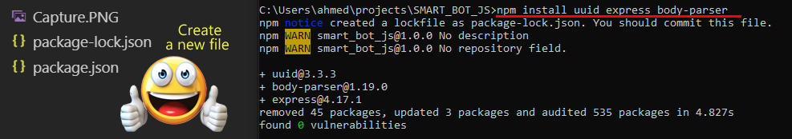
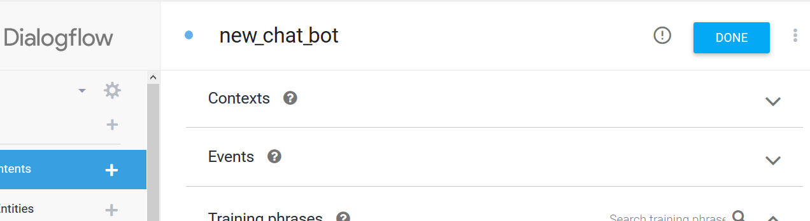
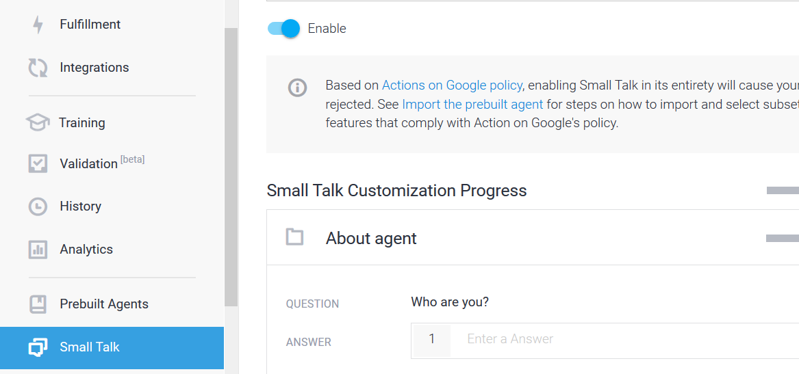

   # Function (Misk_Academy,General_Assembly).Final_Project({
   #### console.log(String.fromCharCode(65,104,109,101,100,"",65,108,103,104,97,109,100,105));
   ## }
# SMART_BOT_JS <br>
<p align="center">
  
</p>
<iframe
    allow="microphone;"
    width="350"
    height="500"
    src="https://console.dialogflow.com/api-client/demo/embedded/a99599b2-15b0-4c20-a9a7-6da6838416c4">
</iframe>
# Description

In this project,I will create A single-page application (SPA) this app with multiple APIs use dialogflow api and giphy api 
with function change background Color.
<br>
## what is the dialogflow?
It's a wonderful tool for creating chat BOTS provided by Google :)it's completely free.

### Step 0

Use this reference [ Google ](https://github.com/googleapis/nodejs-dialogflow)
You should download all files :() Deleted files will appear in the pictures. Don't worry, I will learn you how to create your API
<br>
### Step 1
Go to the path, open the command line
Type the command
```bash
npm init
```
<br><br>
<br>
Thumbs up ,the second command
```bash
npm install uuid express body-parser
```
<br><br>

### Step 2
New go to [dialogflow](https://dialogflow.com)
<br><br>
<br><br>
new Let's learn Bot some of the responses :)
<br><br>
Finally let's take ِAPI form goole:(


than open this link for get api.[console.cloud.google](https://console.cloud.google.com/apis/credentials?project)


## what is the giphy?
search engine that allows users to search for and share short looping videos with no sound
<br>[giphy](https://giphy.com)<br>
#### Don't worry you can use my API :)

## Next Step
Connect the platform with Firebase databases and save all chat.

## Resources
1-[google](https://github.com/googleapis/nodejs-dialogflow) <br>
2-[dialogflow docs](https://dialogflow.com/docs)
