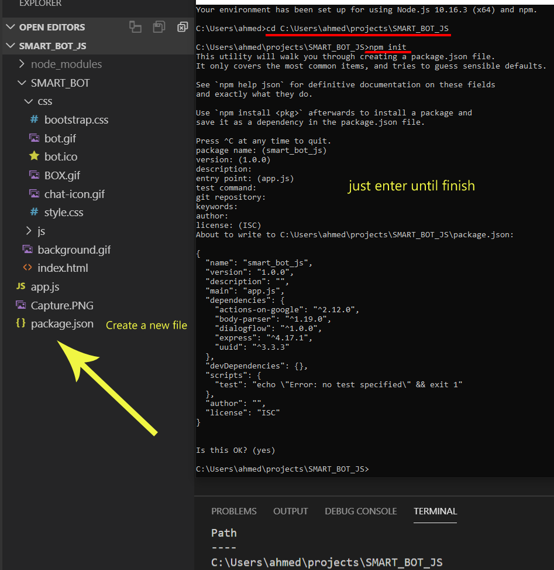

# Misk Academy - General Assembly
## Final Project<br>
<br>
# SMART_BOT_JS <br>
<br>

# Description

In this project,I will create A single-page application (SPA) this app with multiple APIs use dialogflow api and giphy api 
with function change background Color.

## what is the dialogflow?
It's a wonderful tool for creating chat BOTS provided by Google :)it's completely free.

### Step 0

Use this reference [provided by Google ](https://github.com/googleapis/nodejs-dialogflow)
You should download all files :() Deleted files will appear in the pictures. Don't worry, I will learn you how to create your API
<br>
### Step 1
Go to the path, open the command line
Type the command
```bash
npm init
```
<br><br>
<br>
Thumbs up ,the second command
```bash
npm install uuid express body-parser
```
<br><br>

### Step 2
New go to [dialogflow](https://dialogflow.com)
<br><br>
## what is the giphy?
search engine that allows users to search for and share short looping videos with no sound
<br>[giphy](https://giphy.com)<br>
#### Don't worry you can use my API :)

## Next Step
Connect the platform with Firebase databases and save all chat.

## Resources
1-[google](https://github.com/googleapis/nodejs-dialogflow) <br>
2-[dialogflow docs](https://dialogflow.com/docs)
